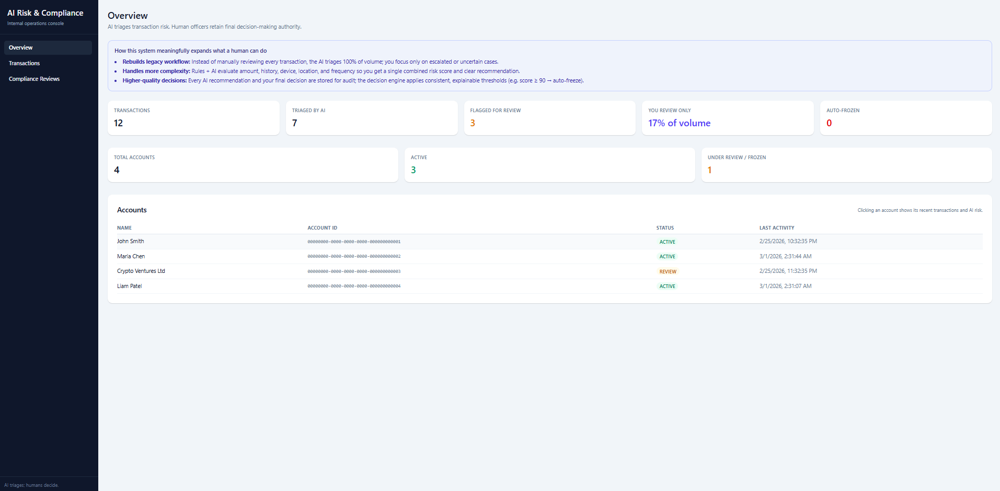
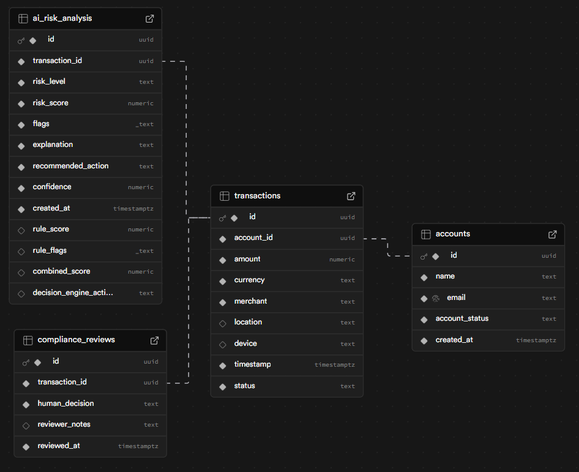
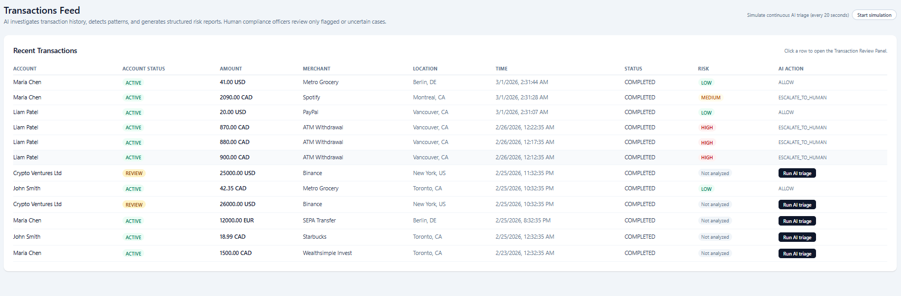
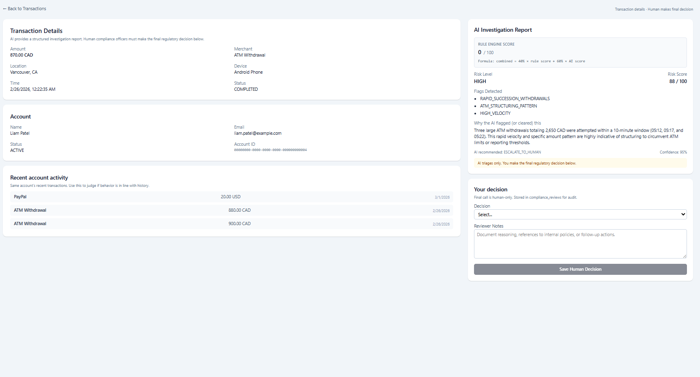

# AI Risk & Compliance Triage System

A fintech-style prototype where **AI triages transactions** and **humans make the final regulatory decision**. The system combines deterministic rules and an AI (Gemini) to score risk, then escalates or auto-freezes only when needed.

---

## Prerequisites

- **Node.js** (v18+)
- **Supabase** account (for PostgreSQL + API)
- **Google AI (Gemini)** API key

---

## 1. Clone and install

```bash
git clone <your-repo-url>
cd ai-compliance-triage-system
npm install
```

---

## 2. Environment variables

Create a `.env` file in the project root:

```env
# Supabase (required for DB)
VITE_SUPABASE_URL=https://your-project.supabase.co
VITE_SUPABASE_ANON_KEY=your-anon-key

# Gemini (required for AI triage)
GEMINI_API_KEY=your-gemini-api-key

# Optional: backend port (default 5000)
# PORT=5000
```

Get **Supabase** values from: Project → Settings → API.  
Get **Gemini** key from: [Google AI Studio](https://aistudio.google.com/apikey).

---

## 3. Database setup (Supabase)

1. In the Supabase dashboard, open the **SQL Editor**.
2. Run the contents of `db/schema.sql` to create tables and indexes.
3. (Optional) Run `db/migrations/001_hybrid_risk_engine.sql` if your schema was created before the hybrid engine (adds `rule_score`, `combined_score`, etc.).
4. (Optional) Run `db/seed.sql` to insert demo accounts and a few sample transactions.

<!-- Add a screenshot: save it as docs/images/supabase-setup.png and it will show below -->
<!--  -->

---

## 4. How to run

You’ll typically run **backend** and **frontend**; the **simulator** is optional (for generating live-like transactions).

### Backend (API)

```bash
npm run server
```

- Runs on **http://localhost:5000** (or `PORT` from `.env`).
- Serves all API routes; must be running for the frontend and simulator.

### Frontend (React + Vite)

```bash
npm run dev
```

- Opens the app (e.g. **http://localhost:5173**).
- Uses the backend at `http://localhost:5000/api` (see `src/api/client.ts` if you change the port).

### Simulator (optional)

```bash
npm run simulate
```

- **Requires the backend to be running** on port 5000.
- Every 5–30 seconds: creates one transaction for a random account, then runs **AI + rule analysis** (same as “Run AI triage” in the UI).
- Use this to see new transactions, risk scores, and auto-freeze in action.

**Quick start (two terminals):**

```text
Terminal 1:  npm run server
Terminal 2:  npm run dev
```

Then open the app in the browser. Add `npm run simulate` in a third terminal to generate traffic.

---

## 5. App overview

<!-- Save your screenshot as docs/images/app-overview.png -->


---

## 6. Supabase table structure

The app uses four main tables. Relationships:

- **accounts** — one row per customer/account (`account_status`: ACTIVE, FROZEN, REVIEW).
- **transactions** — each row references one `account_id`; stores amount, merchant, location, device, timestamp.
- **ai_risk_analysis** — one row per transaction after “Run AI triage” (or simulator analyze): rule score, AI score, combined score, flags, decision (ALLOW / MONITOR / ESCALATE_TO_HUMAN / FREEZE_ACCOUNT).
- **compliance_reviews** — one row per human decision on a transaction (approve, decline, freeze, etc.).

**Relationship summary:**

```text
accounts (1) ──────< transactions (many)
    │
    └── transactions (1) ─── ai_risk_analysis (0 or 1)
    │
    └── transactions (1) ───< compliance_reviews (many)
```

**Screenshot:** save a capture of your Supabase Table Editor as `docs/images/supabase-tables.png` (tables: `accounts`, `transactions`, `ai_risk_analysis`, `compliance_reviews`).



---

## 7. System workflow (text + arrows)

### High-level app flow

```text
User opens app
    │
    ▼
Overview (Dashboard) ──► stats + account list
    │
    ├──► Click account ──► Account details (transactions for that account)
    │
    ├──► Transactions ──► List of all transactions (risk badges, “Run AI triage”)
    │         │
    │         └──► Click row ──► Transaction review (AI report + human decision form)
    │
    └──► Compliance Reviews ──► Log of all human decisions
```

### API request flow (simplified)

```text
Frontend (React)
    │
    ├── GET  /api/accounts          ──► list accounts (+ last_activity)
    ├── GET  /api/accounts/stats    ──► triage/review/frozen counts
    ├── GET  /api/accounts/:id/transactions  ──► transactions for one account
    │
    ├── GET  /api/transactions      ──► list transactions (with account + ai_risk_analysis)
    ├── GET  /api/transactions/:id  ──► one transaction (detail + analysis + reviews)
    ├── POST /api/transactions/create  ──► create transaction (simulator / ingestion)
    ├── POST /api/transactions/analyze   ──► run investigation (rules + AI, persist, maybe freeze)
    └── POST /api/transactions/:id/review ──► save human decision (compliance_reviews)
```

**Legacy (same behavior as analyze):**

```text
POST /api/investigate/:transactionId  ──► same as POST /api/transactions/analyze
```

### What happens when you “Run AI triage” (or simulator calls analyze)

```text
POST /api/transactions/analyze { transactionId }
    │
    ▼
Load transaction + last 20 transactions for same account
    │
    ├──► Rule engine (deterministic) ──► rule_score (0–100) + rule_flags
    │
    ├──► AI (Gemini) ──► risk_score, flags, explanation, recommended_action
    │
    ▼
Combine:  combined_score = 40% × rule_score + 60% × AI risk_score
    │
    ▼
Decision engine ──► ALLOW | MONITOR | ESCALATE_TO_HUMAN | FREEZE_ACCOUNT
    │
    ▼
Upsert ai_risk_analysis (rule_score, combined_score, decision_engine_action, …)
    │
    └──► If FREEZE_ACCOUNT ──► set account.account_status = 'FROZEN'
    │
    ▼
Return result to client
```

---

## 8. More screenshots

<!-- Optional: add docs/images/transactions-list.png and transaction-review.png -->
<!--  -->
<!--  -->

---

## Tech stack

| Layer      | Tech |
|-----------|------|
| Frontend  | React, TypeScript, Vite, Tailwind CSS, React Router |
| Backend   | Node.js, Express, TypeScript |
| Database  | PostgreSQL (Supabase) |
| AI        | Google Gemini (via `@google/genai`) |

---

## Scripts reference

| Command           | Description |
|-------------------|-------------|
| `npm run dev`     | Start Vite dev server (frontend) |
| `npm run server`  | Start Express API (backend) |
| `npm run simulate`| Create + analyze transactions periodically (backend must be running) |
| `npm run build`   | TypeScript build + Vite production build |
| `npm run preview` | Preview production build |
| `npm run lint`    | Run ESLint |

---

---

## Adding screenshots

1. **Create the folder** (already done): `docs/images/`
2. **Save your screenshots** there, e.g.:
   - `docs/images/app-overview.png` — dashboard
   - `docs/images/supabase-tables.png` — Supabase Table Editor
   - `docs/images/transactions-list.png` — transactions list
   - `docs/images/transaction-review.png` — transaction review page
3. **Reference in README** with Markdown:
   ```markdown
   
   ```
   The path is relative to the project root. GitHub (and most Git hosts) will show the image in the README. If a file is missing, the image will appear broken until you add it.

---

*AI triages; humans decide.*
